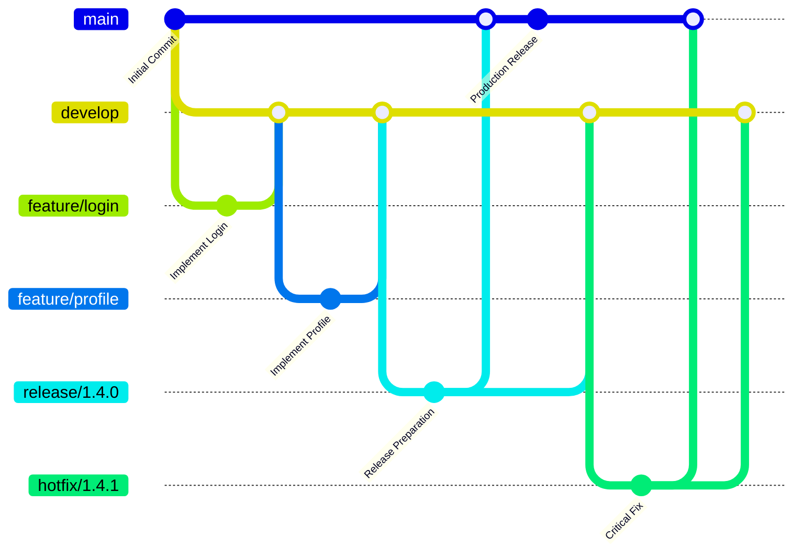
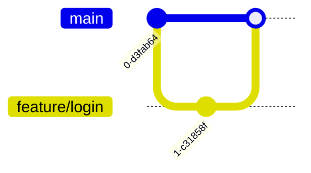
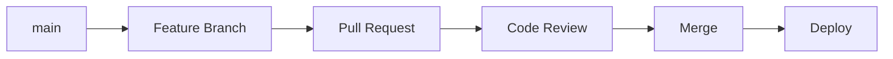
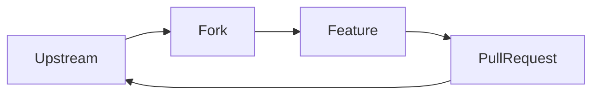
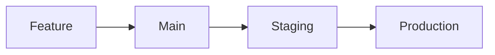
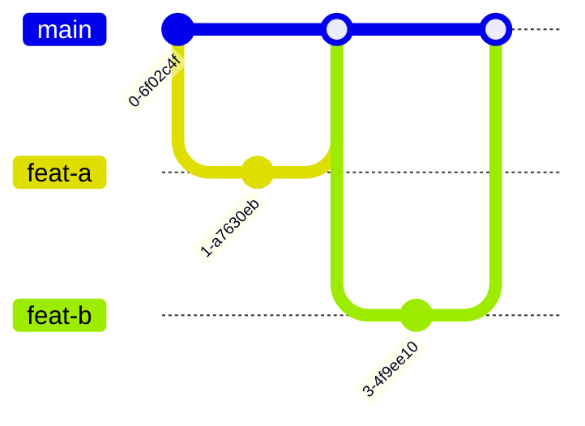
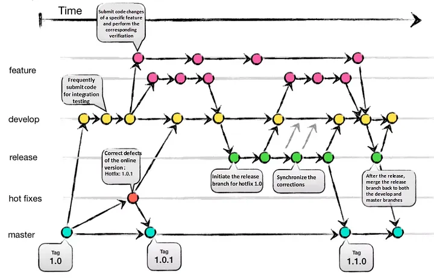
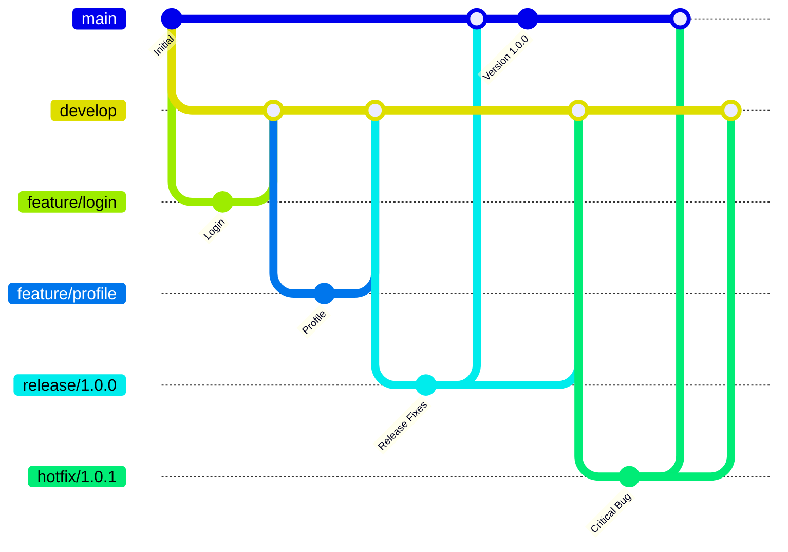
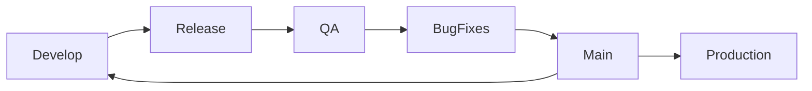
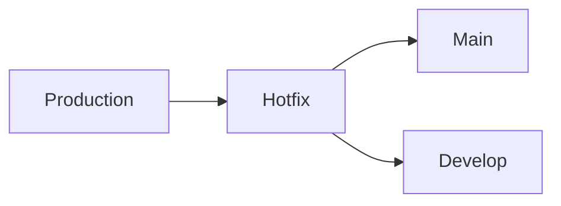

# Git Branch Strategies & Branch Types

> [!NOTE]
> This section introduces the most common Git branch types used in modern software development. Each branch has a specific responsibility within the development lifecycle, helping teams organize work, collaborate efficiently, and maintain a stable production environment.

---

# Branch Types

Git repositories commonly contain several branch types, each designed for a specific purpose. Separating work into dedicated branches minimizes merge conflicts, enables parallel development, simplifies release management, and improves repository organization.

| Branch Type | Lifetime | Primary Purpose |
|-------------|----------|-----------------|
| `main` | Permanent | Production-ready source code |
| `develop` | Permanent | Integration branch for ongoing development |
| `feature/*` | Temporary | New functionality |
| `bugfix/*` | Temporary | Non-critical bug fixes |
| `release/*` | Temporary | Release preparation and stabilization |
| `hotfix/*` | Temporary | Critical production fixes |
| `support/*` | Long-lived | Maintenance of previous production versions |

---

## Less Common Branch Types

These branches are not part of the original Git Flow model but are frequently adopted by development teams to organize specific types of work.

| Branch Type | Lifetime | Primary Purpose |
|-------------|----------|-----------------|
| `experiment/*` | Temporary | Experimental implementations |
| `spike/*` | Temporary | Research or proof of concept |
| `docs/*` | Temporary | Documentation updates |
| `chore/*` | Temporary | Maintenance tasks |
| `refactor/*` | Temporary | Internal code improvements |
| `test/*` | Temporary | Testing and validation |

---

# Branch Hierarchy

The following diagram illustrates a typical repository structure based on the Git Flow branching model.



---

# Main Branch (`main`)

> [!IMPORTANT]
> The **main** branch always represents the latest stable and production-ready version of the application. Every commit on this branch should be deployable and should have passed all required testing and code review processes.

The `main` branch should never contain unfinished work or experimental code. New features are developed in separate branches and merged into `main` only after they have been reviewed, tested, and approved.

In most teams, deployments to production are performed directly from the `main` branch.

**Example**

```text
main

v1.2.0
v1.3.0
v1.4.0   ← Latest Production Version
```

> [!TIP]
> A common Git Flow best practice is to keep the `main` branch **release-only**. Ideally, every commit on `main` should represent an official production release, making the branch easy to navigate, tag, audit, and roll back when necessary.

---

# Develop Branch (`develop`)

> [!NOTE]
> The `develop` branch serves as the primary integration branch in Git Flow.

Completed features are merged into `develop`, allowing multiple developers to integrate their work before a release is prepared. Unlike `main`, the `develop` branch may contain changes that are still under testing and are not yet ready for production.

Once all planned features for a release have been completed, a release branch is created from `develop`.

---

# Feature Branches (`feature/*`)

> [!TIP]
> Every new feature should be implemented in its own dedicated branch.

Feature branches isolate development work from the rest of the project, allowing multiple developers to work independently without affecting the stability of the integration branch.

Typical examples include:

```text
feature/login

feature/user-profile

feature/payment-service

feature/email-notifications
```

After implementation, the branch is reviewed, tested, merged into `develop`, and then deleted.

---

# Bugfix Branches (`bugfix/*`)

Bugfix branches are used to correct defects discovered during development or testing that are **not yet affecting the production environment**.

Unlike hotfixes, bugfix branches are usually created from `develop` and merged back into `develop` after the issue has been resolved.

Examples:

```text
bugfix/login-validation

bugfix/cart-calculation

bugfix/search-results
```

---

# Release Branches (`release/*`)

> [!IMPORTANT]
> Release branches are **temporary branches** used to prepare a new software version for production.

Once the planned features for a version have been completed, a release branch is created from `develop`. From this point forward, no new functionality should be added. The only allowed changes are those required to finalize the release.

Typical activities performed inside a release branch include:

- Bug fixing
- Regression testing
- Documentation updates
- Version number updates
- Dependency verification
- Performance optimization
- Final quality assurance

For example:

```text
release/1.4.0
```

During this period, developers can continue implementing future features in the `develop` branch without affecting the upcoming release.

After the release has been approved:

1. The release branch is merged into `main`.
2. A version tag is created.
3. The release branch is merged back into `develop`.
4. The release branch is deleted.

> [!NOTE]
> Release branches are **not intended to permanently store released versions**. Their purpose is only to stabilize an upcoming release before deployment.

---

# Hotfix Branches (`hotfix/*`)

> [!WARNING]
> Hotfix branches should only be created when a **critical issue affects the production environment** and an immediate fix is required.

Unlike `bugfix/*` branches, which are created from `develop`, **hotfix branches originate directly from `main`** because they address issues in the version that is currently running in production. This allows teams to resolve critical problems without waiting for the next planned release or deploying unfinished features from the `develop` branch.

Example:

```text
hotfix/1.4.1
```

## Typical Workflow

```text
main (v1.4.0)
      │
      ▼
hotfix/1.4.1
      │
      ├──► main
      └──► develop
```

After the fix has been implemented, tested, and validated, the hotfix branch is merged into both:

- `main` – to deploy the fix to production.
- `develop` – to ensure that the upcoming release also contains the same fix.

> [!NOTE]
> Imagine an e-commerce application where version **1.4.0** is already running in production. While the development team is working on version **1.5.0**, customers suddenly report that ****credit card payments no longer work**. Since waiting for the next scheduled release is not an option, a `hotfix/1.4.1` branch is created from `main`, the **issue is fixed and deployed immediately**, and the same changes are merged back into `develop` so the bug does not reappear in future releases.

---

# Support Branches (`support/*`)

> [!NOTE]
> Support branches are **long-lived maintenance branches** used only when older software versions must continue receiving updates after newer versions have already been released.

Unlike release branches, support branches remain active for as long as an older version is officially supported.

For example, suppose version **3.0** is the latest production release, but some customers are still using version **2.x**.

The repository might look like this:

```text
main
└── v3.0.0

support/2.x
├── 2.1.1
├── 2.1.2
└── 2.1.3
```

Critical security patches and bug fixes can continue to be applied to the `support/2.x` branch without affecting the latest version of the application.

> [!TIP]
> Support branches are common in enterprise software, banking systems, ERP platforms, and products with long-term support (LTS) policies.

---

# Git Tags

> [!IMPORTANT]
> Git tags are **not branches**. A tag is a permanent reference to a specific commit and is commonly used to mark official software releases.

Unlike branches, tags never move after they are created.

Example:

```text
main

●────●────●────●────●
      │    │    │
      │    │    └── v1.4.0
      │    └─────── v1.3.0
      └──────────── v1.2.0
```

When a release branch has been merged into `main`, a tag is usually created:

```bash
git tag v1.4.0
git push origin v1.4.0
```

Tags provide several advantages:

- Mark official releases.
- Allow developers to easily retrieve previous versions.
- Simplify release management.
- Improve deployment traceability.
- Preserve historical versions without creating additional branches.

> [!NOTE]
> In a standard Git Flow workflow, previous releases are normally preserved using **Git tags**, not release branches.

---

# Typical Git Flow Repository

The following example illustrates how a repository may look after several releases.

```text
main
│
├── v1.2.0
├── v1.3.0
├── v1.4.0
└── Latest Production

develop

support/1.x

feature/payment-api

feature/user-dashboard

hotfix/1.4.1
```

Notice that:

- Previous releases are identified using **Git tags**.
- `release/*` branches no longer exist because they are deleted after deployment.
- Older maintained versions are preserved through **support branches**, not release branches.
- `main` always points to the latest production-ready version.

---

# Git Branching Strategies

> [!NOTE]
> The following branching strategies are ordered from the simplest and least structured to the most comprehensive and structured. The ranking is based on workflow complexity, release management capabilities, and suitability for large-scale software development—not on overall quality. Each strategy is valuable when applied in the appropriate context.

---
# 1. Feature Branch Workflow

The **Feature Branch Workflow** is one of the simplest and most widely adopted Git branching strategies. Every new feature, enhancement, or bug fix is developed in its own isolated branch, allowing developers to work independently without affecting the stability of the main codebase.

Unlike more complex workflows such as Git Flow, Feature Branch Workflow introduces only one additional branch type (`feature/*`), making it easy to understand, maintain, and adopt. Once development is complete, the feature branch is merged back into the primary branch (typically `main` or `develop`) through a Pull Request.

## Branch Hierarchy

```text
main
├── feature/login
├── feature/profile
├── feature/payment
└── feature/dashboard
```

### Branch Relationships

- `main` contains the current stable version of the application.
- Every `feature/*` branch is created directly from `main`.
- Feature branches never merge into each other.
- Once completed, feature branches are merged back into `main` and deleted.

This keeps the repository clean while allowing multiple developers to work simultaneously.



> [!TIP]
> **Feature Branch Workflow is one of the best branching strategies for hackathons.** Its simplicity allows teams to collaborate quickly without introducing unnecessary workflow complexity. Developers can implement features independently and merge them rapidly, making it ideal for projects with limited time and frequent collaboration.

---

# 2. GitHub Flow

GitHub Flow builds upon the Feature Branch Workflow by introducing Pull Requests, mandatory code reviews, and continuous deployment practices. It is designed for teams that deploy frequently and maintain a production-ready `main` branch at all times.

The workflow encourages developers to create short-lived feature branches, submit Pull Requests, and merge changes only after automated testing and peer review.

## Branch Hierarchy

```text
main
├── feature/login
├── feature/payment
├── feature/profile
└── feature/search
```

### Branch Relationships

- `main` always contains deployable code.
- Every feature branch originates from `main`.
- Pull Requests are used before merging.
- Once merged, branches are removed.
- Deployments are usually triggered automatically after merging.



> [!NOTE]
> GitHub Flow is ideal for teams practicing Continuous Integration (CI) and Continuous Deployment (CD), where every successful merge can immediately become a production deployment.

---

# 3. Forking Workflow

Forking Workflow differs significantly from other branching strategies because contributors do not work directly within the central repository. Instead, each developer creates a personal copy (fork) of the repository and performs all development there.

This workflow is especially popular in open-source projects, where repository maintainers need to accept contributions from external developers without granting direct write access.

## Branch Hierarchy

```text
Upstream Repository
        │
        ├── Fork (Developer A)
        │      ├── feature/login
        │      └── feature/dashboard
        │
        ├── Fork (Developer B)
        │      └── feature/payment
        │
        └── Fork (Developer C)
               └── feature/search
```

### Branch Relationships

- Every contributor owns a personal repository.
- Feature branches are created inside the contributor's fork.
- Changes are submitted through Pull Requests.
- Repository maintainers review and merge approved contributions into the upstream repository.



> [!NOTE]
> Because contributors work in isolated repositories, Forking Workflow provides excellent security and repository protection while supporting thousands of contributors simultaneously.

---

# 4. GitLab Flow

GitLab Flow combines the simplicity of GitHub Flow with structured deployment pipelines by introducing environment branches such as `staging` and `production`.

Rather than creating dedicated release branches, code progresses through deployment environments until it reaches production.

## Branch Hierarchy

```text
feature/*
      │
      ▼
main
      │
      ▼
staging
      │
      ▼
production
```

### Branch Relationships

- Feature branches originate from `main`.
- Completed work is merged into `main`.
- The application is promoted through deployment environments.
- Environment branches represent deployment stages rather than development stages.



> [!NOTE]
> GitLab Flow is particularly useful for cloud-native applications where code must pass through multiple deployment environments before reaching production.

---

# 5. Trunk-Based Development

Trunk-Based Development minimizes branching by encouraging developers to integrate small changes into a shared branch several times per day.

Branches exist only briefly and are merged almost immediately after implementation. This approach reduces merge conflicts and supports rapid Continuous Integration.

## Branch Hierarchy

```text
main
├── feature/login
├── feature/payment
├── feature/search
└── feature/profile
```

Unlike Git Flow, no long-lived `develop`, `release`, or `support` branches exist.

### Branch Relationships

- Every feature branch originates from `main`.
- Branches remain active only for a short period.
- Developers merge changes multiple times each day.
- Automated testing validates every integration.
- Feature flags are commonly used to hide unfinished functionality.



> [!IMPORTANT]
> Trunk-Based Development requires a mature CI/CD pipeline, comprehensive automated testing, and disciplined development practices. Without these, frequent integrations can quickly destabilize the shared branch.

> [!TIP]
> It`s very similar and almost identical to **Feature Branch Workflow**.
---

# 6. Git Flow

> [!IMPORTANT]
> Git Flow is a structured Git branching model designed for projects that follow planned release cycles and require a clear separation between development, testing, and production code. It introduces multiple dedicated branch types that organize the entire software development lifecycle, from implementing new features to preparing releases and delivering emergency fixes.

Originally proposed by **[Vincent Driessen](https://nvie.com/posts/a-successful-git-branching-model/)**, Git Flow has become one of the most well-known branching strategies and is widely adopted by enterprise organizations where stability, traceability, and release management are higher priorities than deployment speed.

---

## Overview

Unlike lightweight workflows such as GitHub Flow or Trunk-Based Development, Git Flow separates development into several specialized branches. Each branch has a well-defined responsibility, making the workflow predictable and easier to manage in large teams.

The strategy revolves around two permanent branches:

- **`main`** – always contains production-ready code.
- **`develop`** – serves as the primary integration branch where completed features are combined before a release.

Temporary branches are then created for specific purposes:

- **Feature branches** for implementing new functionality.
- **Release branches** for stabilizing an upcoming version.
- **Hotfix branches** for fixing critical production issues.

This separation allows multiple teams to work simultaneously without affecting the stability of the production environment.

---

## Git Flow Branch Structure





---

# Branch Types

| Branch | Purpose |
|---------|----------|
| `main` | Stores production-ready releases |
| `develop` | Main integration branch |
| `feature/*` | Development of new functionality |
| `release/*` | Stabilization before production |
| `hotfix/*` | Emergency fixes for production |

---

# Development Workflow

The typical Git Flow lifecycle follows these steps:

1. Developers create a **feature branch** from `develop`.
2. New functionality is implemented independently.
3. The completed feature is reviewed and merged back into `develop`.
4. Once enough features have been completed, a **release branch** is created.
5. Only bug fixes, documentation updates, and version changes are allowed inside the release branch.
6. After QA approval, the release branch is merged into `main`.
7. The same release branch is merged back into `develop` to synchronize both branches.
8. If a production issue appears later, a **hotfix branch** is created directly from `main`.

---

## Complete Development Lifecycle

```text
main
 │
 ├────────────── Production
 │
 │
develop
 │
 ├── feature/login
 │
 ├── feature/profile
 │
 ├── feature/payment
 │
 ▼
release/1.0
 │
 ▼
main (Production)
 │
 ▼
hotfix/1.0.1
```

---

# Feature Development

Each new feature is isolated inside its own branch.

Example:

```text
develop
    │
    ├── feature/login
    ├── feature/profile
    ├── feature/payment-api
    └── feature/dashboard
```

Developers can work independently without interfering with each other's work.

Once a feature is completed:

- code review is performed;
- automated tests are executed;
- the feature branch is merged into `develop`;
- the feature branch is deleted.

This keeps the repository clean while allowing multiple parallel development efforts.

---

# Release Workflow

When all planned features for a version are complete, development enters the release phase.

A dedicated release branch is created:

```text
release/2.3.0
```

Only release-related changes should be made here, such as:

- bug fixes
- documentation updates
- version number changes
- dependency verification
- regression fixes
- configuration adjustments

No new features should be added during this phase.

---

## Release Lifecycle



---

# Hotfix Workflow

Production issues require immediate attention.

Instead of waiting for the next scheduled release, Git Flow creates a dedicated hotfix branch directly from `main`.

Example:

```text
main
   │
   └── hotfix/2.3.1
```

After the issue has been resolved:

1. Merge into `main`.
2. Deploy immediately.
3. Merge the same hotfix into `develop`.

This guarantees that future releases also contain the fix.

---

## Hotfix Lifecycle



---

# Advantages

## Clear separation of responsibilities

Every branch has a single well-defined purpose. Developers always know where new features, releases, and production fixes belong.

---

## Excellent release management

Release branches allow QA teams to stabilize an application while developers continue implementing future functionality.

---

## Stable production branch

The `main` branch always represents a deployable version of the software.

---

## Parallel development

Several teams can implement independent features simultaneously without blocking one another.

---

## Version maintenance

Git Flow makes it straightforward to maintain multiple production versions.

For example:

```text
main

v1.8

v2.0

v2.1
```

Each version can receive independent hotfixes if required.

---

## Predictable workflow

Because every release follows the same sequence of steps, deployment becomes highly repeatable and easier to audit.

---

# Disadvantages

## Increased complexity

Git Flow introduces several branch types and merge operations that new developers must understand.

---

## Long-lived branches

Feature and release branches may remain active for extended periods, increasing the likelihood of merge conflicts.

---

## Slower delivery

Every feature must progress through several stages before reaching production.

---

## Higher maintenance overhead

Developers must continuously synchronize feature, release, and hotfix branches.

---

## Less suitable for Continuous Deployment

Organizations deploying many times each day usually prefer GitHub Flow or Trunk-Based Development.

---

# Best Practices

- Protect both `main` and `develop`.
- Require Pull Request reviews.
- Require successful CI before merging.
- Keep feature branches focused on one feature.
- Keep release stabilization short.
- Merge hotfixes back into `develop`.
- Tag every production release.
- Delete merged feature branches.


---

# Example Repository

```text
main

develop

feature/login

feature/payment

feature/dashboard

release/2.0.0

hotfix/2.0.1
```

---

# When to Avoid Git Flow

Git Flow may not be the best option when:

- deploying several times per day;
- practicing Continuous Deployment;
- working with a small startup team;
- building simple web applications;
- prioritizing rapid feature delivery over structured releases.

---


