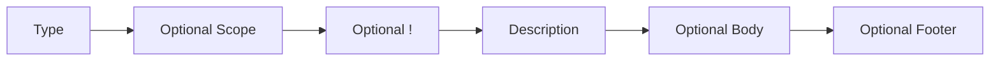
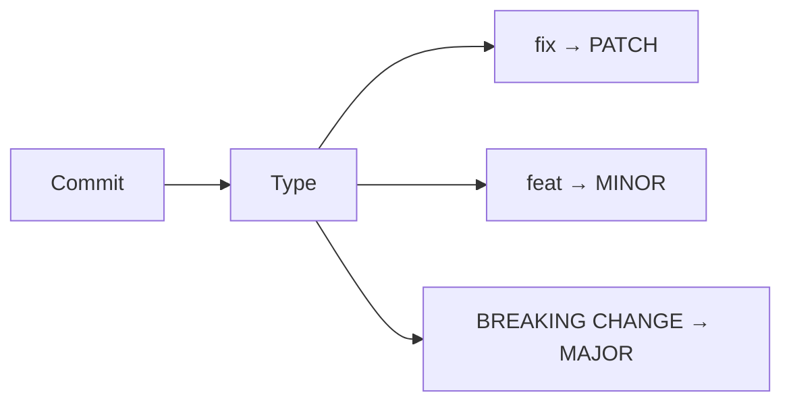
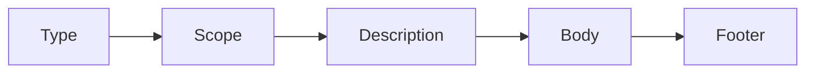

# Conventional Commits

> [!NOTE]
> Conventional Commits is a standardized convention for writing Git commit messages. By following a consistent format, commit history becomes easier to read, automate, and maintain. The specification is widely used alongside Semantic Versioning (SemVer), automated changelog generation, Continuous Integration (CI), and release automation tools.

---

# Quick Reference

## General Syntax

```text
<type>[optional scope][!]: <description>
```

## Decide which commit type to use

| Situation | Commit Type |
|-----------|-------------|
| Added a new feature | `feat` |
| Fixed a bug | `fix` |
| Updated documentation | `docs` |
| Reformatted code | `style` |
| Improved internal code structure | `refactor` |
| Added automated tests | `test` |
| Updated Docker or Maven | `build` |
| Modified GitHub Actions | `ci` |
| Updated dependencies | `chore` |
| Improved performance | `perf` |
| Reverted a previous commit | `revert` |
| Breaking feature | `feat!` |
| Breaking bug fix  | `fix!` |

---

# Why Use Conventional Commits?

Writing descriptive commit messages is important, but using a standardized format provides significantly more value than free-form messages.

Conventional Commits make it possible to:

- Produce consistent and readable commit history.
- Clearly identify the purpose of every commit.
- Automatically generate release notes and changelogs.
- Automatically determine semantic version increments.
- Improve collaboration across development teams.
- Simplify code reviews.
- Make repository history easier to navigate.

---

## Traditional vs Conventional Commits

The following table highlights the key differences between traditional commit messages and Conventional Commits.

| Aspect | Traditional Commit | Conventional Commit |
|--------|--------------------|---------------------|
| Structure | No defined format | Standardized format (`type(scope): description`) |
| Readability | Often unclear | Clear and self-explanatory |
| Purpose | Difficult to determine | Immediately communicates the intent of the change |
| Affected Module | Usually not specified | Optional scope identifies the affected component |
| Automation | Not suitable for automation | Supports changelog generation, release automation, and Semantic Versioning |
| Consistency | Depends on the developer | Consistent across the entire project |
| Collaboration | Harder to review | Easier for teams to understand and review |
| CI/CD Integration | Limited | Fully compatible with modern DevOps workflows |

### Example Comparison

| Traditional Commit | Conventional Commit |
|--------------------|---------------------|
| `Update` | `feat(auth): add OAuth2 login` |
| `Fix bug` | `fix(api): handle null user response` |
| `README changes` | `docs(readme): add Docker setup guide` |
| `Code cleanup` | `refactor(database): split repository layer` |
| `Tests` | `test(auth): add login unit tests` |

> [!NOTE]
> Conventional Commits provide significantly more context than traditional commit messages. A well-structured commit immediately tells reviewers **what changed**, **which part of the project was affected**, and **the purpose of the change**, while also enabling automation tools to generate changelogs, determine semantic version updates, and improve overall repository maintainability.

---

# Commit Message Anatomy

Every Conventional Commit follows the same general structure.

```text
<type>[optional scope][!]: <description>

[optional body]

[optional footer(s)]
```

Only the **type** and **description** are mandatory.

Everything else is optional and should only be included when appropriate.

---

## Commit Structure



---

## Complete Anatomy

```text
feat(auth)!: implement OAuth2 authentication

The authentication module now supports OAuth2 providers,
including Google and GitHub.

BREAKING CHANGE: Legacy authentication endpoints have been removed.
```

---

# Commit Components

| Component | Required | Purpose |
|-----------|----------|---------|
| Type | ✔ | Describes the type of change |
| Scope | Optional | Indicates the affected module |
| `!` | Optional | Marks a breaking change |
| Description | ✔ | Short summary of the change |
| Body | Optional | Provides additional context |
| Footer | Optional | References issues, breaking changes, metadata |

---

# General Syntax

```text
<type>[optional scope][!]: <description>
```

Examples:

```text
feat(auth): add OAuth2 login

fix(api): return 404 for unknown user

docs(readme): update installation guide

refactor(ui): simplify navigation component

perf(database): reduce query execution time
```

---

# Commit Description Rules

> [!IMPORTANT]
> The description should clearly summarize the change in **50 characters or fewer**, using the **imperative mood**.

Think of the description as completing the sentence:

> **If applied, this commit will...**

Correct examples:

```text
add user authentication

fix login validation

remove deprecated endpoint

update Docker configuration

rename database service
```

Incorrect examples:

```text
Added login page

Adds login page

Fixed bug

Some changes

Work in progress

Final version

Update
```

---

## Good vs Bad Examples

| Good | Bad |
|------|-----|
| `add profile page` | `profile` |
| `handle null response` | `bug fix` |
| `add installation guide` | `changes` |
| `reduce query time` | `database improvements` |

---

# Optional Scope

The optional scope identifies the subsystem, module, or component affected by the commit.

The scope appears immediately after the commit type and is enclosed in parentheses.

```text
<type>(scope): description
```

Examples:

```text
feat(auth): add OAuth login

fix(api): validate request body

docs(readme): update installation guide

refactor(database): optimize repository layer
```

---

## Common Scope Examples

| Scope | Description |
|--------|-------------|
| `auth` | Authentication module |
| `api` | REST API |
| `ui` | User Interface |
| `database` | Database layer |
| `backend` | Backend services |
| `frontend` | Frontend application |
| `docker` | Docker configuration |
| `readme` | Project documentation |
| `github-actions` | CI/CD workflows |
| `payment` | Payment module |
| `notifications` | Notification service |

---

# Breaking Changes

Some commits introduce changes that are **not backward compatible**.

These are called **breaking changes** because existing consumers of the software must update their code to remain compatible.

There are two supported ways to indicate a breaking change.

---

## Method 1 — Using `!`

The exclamation mark is placed immediately after the type or scope.

```text
feat(api)!: change response format

refactor(auth)!: redesign authentication flow

chore!: drop support for Node 18
```

This is the most common approach.

---

## Method 2 — Using a Footer

Breaking changes can also be declared in the footer.

```text
feat(api): redesign authentication

BREAKING CHANGE:
Authentication tokens are no longer stored in cookies.
```

---

## Both Methods Together

```text
feat(api)!: redesign authentication

BREAKING CHANGE:
Legacy authentication endpoints have been removed.
```

Using both improves readability while remaining fully compliant with the specification.

---

# Commit Types

> [!TIP]
> The commit type is the most important part of a Conventional Commit. It categorizes the change and allows tools to automatically generate release notes, determine semantic version updates, and organize commit history.

The most commonly used commit types are:

| Type | Purpose |
|------|---------|
| `feat` | Introduce new functionality |
| `fix` | Correct a bug |
| `docs` | Documentation changes |
| `style` | Formatting and style changes |
| `refactor` | Code restructuring without behavior changes |
| `test` | Add or update automated tests |
| `build` | Build system changes |
| `ci` | Continuous Integration configuration |
| `chore` | Maintenance tasks |
| `perf` | Performance improvements |
| `revert` | Revert a previous commit |

---

## `feat`

> [!IMPORTANT]
> The `feat` type is used whenever a commit introduces **new functionality** that did not previously exist.

Typical examples include:

- Adding a new page.
- Creating a new API endpoint.
- Supporting a new authentication provider.
- Introducing a new service.
- Adding a new command.

Examples:

```text
feat(auth): add OAuth2 login

feat(ui): add profile page

feat(api): create users endpoint

feat(payment): support PayPal payments
```

---

## `fix`

The `fix` type is used whenever a commit corrects incorrect or unintended behavior.

A `fix` should resolve a defect without introducing unrelated functionality.

Examples:

```text
fix(api): return 404 for unknown users

fix(auth): validate expired tokens

fix(ui): correct responsive navigation

fix(database): prevent duplicate records
```

> [!NOTE]
> Bug fixes generally correspond to **PATCH** version increments in Semantic Versioning.

---

## `docs`

The `docs` type is reserved exclusively for documentation updates.

Documentation commits should not modify application behavior.

Examples:

```text
docs(readme): add installation guide

docs(api): document authentication endpoint

docs(contributing): update pull request process

docs: fix spelling mistakes
```

Common documentation includes:

- README files
- CONTRIBUTING guides
- Architecture documentation
- API references
- Tutorials
- Project wiki

---

## `style`

The `style` type is used for changes that **do not affect the runtime behavior of the application**.

Typical style changes include:

- code formatting;
- whitespace adjustments;
- indentation;
- missing semicolons;
- lint fixes;
- import ordering.

Examples:

```text
style(ui): format login component

style(api): organize imports

style: remove trailing whitespace

style(database): apply formatter
```

> [!WARNING]
> Do not use `style` for UI redesigns or visual improvements. If the application's behavior or appearance changes for users, another commit type (such as `feat`) is usually more appropriate.

---

## `refactor`

Refactoring changes the internal structure of the code **without changing its external behavior**.

The objective is to improve readability, maintainability, or architecture while preserving existing functionality.

Before:

```java
if (test.isEmpty()) {
    return null;
}

return test.get();
```

After:

```java
return test.orElse(null);
```

Examples:

```text
refactor(auth): split AuthService into smaller modules

refactor(api): extract validation logic

refactor(database): simplify repository implementation

refactor(ui): remove duplicated components
```

> [!TIP]
> If the code behaves differently after your changes, the commit is probably **not** a refactor. Consider using `feat` or `fix` instead.

## `test`

The `test` type is used for commits that add, update, or improve **automated tests**. These commits verify that existing functionality behaves as expected and help prevent future regressions.

Typical test-related changes include:

- Unit tests
- Integration tests
- End-to-end (E2E) tests
- Mock implementations
- Test fixtures
- Test utilities

Examples:

```text
test(auth): add login unit tests

test(api): add integration tests for users endpoint

test(ui): verify responsive navigation

test(database): add repository tests
```

> [!NOTE]
> `test` commits should only modify testing code. If application logic is also changed, consider splitting the changes into separate commits.

---

## `build`

The `build` type is used for changes that affect the project's **build system**, dependency management, packaging, or compilation process.

Typical examples include:

- Docker
- Maven
- Gradle
- npm
- pnpm
- Make / CMake
- Vite
- Webpack
- Rollup

Examples:

```text
build(docker): add production image

build(maven): upgrade Spring Boot version

build(npm): update dependencies

build(vite): enable source maps
```

Common build-related files include:

```text
Dockerfile

docker-compose.yml

package.json

pom.xml

build.gradle

vite.config.ts

webpack.config.js
```

> [!IMPORTANT]
> Build commits modify **how the project is built**, not how the application behaves.

---

# `ci`

Continuous Integration (CI) commits modify automated workflows responsible for building, testing, validating, or deploying the application.

Typical CI platforms include:

- GitHub Actions
- GitLab CI
- Jenkins
- Azure Pipelines
- CircleCI
- Travis CI

Examples:

```text
ci(github-actions): add Node 22 workflow

ci(jenkins): enable parallel builds

ci(gitlab): cache Maven dependencies

ci: add security scan
```

Typical files include:

```text
.github/workflows/

.gitlab-ci.yml

Jenkinsfile

azure-pipelines.yml
```

> [!TIP]
> Use `ci` only for pipeline configuration. If you modify the application's build configuration (such as Docker or Maven), use the `build` type instead.

---

# `chore`

The `chore` type is used for repository maintenance tasks that do not modify application functionality.

These changes typically involve housekeeping, project configuration, dependency management, or tooling updates.

Common examples include:

- Updating `.gitignore`
- Installing development dependencies
- Updating package versions
- Cleaning repository configuration
- Configuring linters
- Updating editor settings

Examples:

```text
chore: update .gitignore

chore(deps): upgrade dependencies

chore(config): add EditorConfig

chore: remove unused assets
```

Unlike most commit types, `chore` commits are commonly written without a scope.

---

# `perf`

The `perf` type is reserved for commits that improve application performance **without changing functionality**.

Performance improvements may include:

- Faster algorithms
- Reduced database queries
- Improved caching
- Lower memory usage
- Reduced network traffic
- Better rendering performance

Examples:

```text
perf(api): reduce database queries

perf(ui): optimize table rendering

perf(database): improve indexing

perf(cache): reduce Redis lookups
```

> [!IMPORTANT]
> Performance optimizations should preserve existing functionality. If user-visible behavior changes, another commit type may be more appropriate.

---

# `revert`

The `revert` type indicates that a previous commit has been undone.

Rather than manually reversing changes, Git automatically creates a dedicated revert commit.

Example:

```text
revert: feat(ui): add profile page
```

Git usually generates messages similar to:

```text
Revert "feat(ui): add profile page"
```

This creates a new commit that safely reverses the previous changes while preserving repository history.

---

# Commit Type Decision Guide

Choosing the correct commit type is essential for maintaining a meaningful commit history.

The following table summarizes when each type should be used.

| Situation | Commit Type |
|-----------|-------------|
| Added a new feature | `feat` |
| Fixed a bug | `fix` |
| Updated documentation | `docs` |
| Reformatted code | `style` |
| Improved internal code structure | `refactor` |
| Added automated tests | `test` |
| Updated Docker or Maven | `build` |
| Modified GitHub Actions | `ci` |
| Updated dependencies | `chore` |
| Improved performance | `perf` |
| Reverted a previous commit | `revert` |

---

# Semantic Versioning Integration

One of the primary reasons Conventional Commits exist is to automate **Semantic Versioning (SemVer)**.

A commit type can determine how the application's version number should be incremented.

| Commit | Version Increment |
|----------|------------------|
| `fix` | PATCH |
| `feat` | MINOR |
| `feat!` or `BREAKING CHANGE` | MAJOR |

---

## Semantic Version Structure

```text
MAJOR.MINOR.PATCH
```

Example:

```text
2.5.8
```

Where:

- **MAJOR** introduces incompatible API changes.
- **MINOR** adds backward-compatible functionality.
- **PATCH** fixes backward-compatible bugs.


| Type | Purpose | Typical Version |
|------|---------|-----------------|
| `feat` | New functionality | MINOR |
| `fix` | Bug fix | PATCH |
| `docs` | Documentation | None |
| `style` | Formatting | None |
| `refactor` | Internal restructuring | None |
| `test` | Automated tests | None |
| `build` | Build system | None |
| `ci` | CI/CD configuration | None |
| `chore` | Maintenance | None |
| `perf` | Performance improvements | PATCH |
| `revert` | Undo previous commit | Depends |
| `feat!` | Breaking feature | MAJOR |
| `fix!` | Breaking bug fix | MAJOR |

---

## Version Increment Examples

### Patch Release

```text
fix(auth): validate expired tokens
```

```text
1.4.2

↓

1.4.3
```

---

### Minor Release

```text
feat(ui): add notifications page
```

```text
1.4.3

↓

1.5.0
```

---

### Major Release

```text
feat(api)!: redesign authentication
```

```text
1.5.0

↓

2.0.0
```

---

## Conventional Commits and Semantic Versioning



---

# Commit Body

The commit body provides additional context when the description alone is insufficient.

The body is optional but recommended for complex changes.

Example:

```text
feat(auth): implement OAuth2 authentication

Added Google and GitHub authentication providers.

Existing username/password authentication
remains fully supported.
```

A commit body should explain:

- Why the change was necessary.
- How it was implemented.
- Important implementation details.
- Limitations or known issues.

---

# Commit Footers

Footers provide structured metadata that can be interpreted by Git hosting platforms and automation tools.

Common footers include:

```text
Closes #42

Fixes #103

Refs #18

Reviewed-by: John Doe

Co-authored-by: Jane Doe
```

Footers are commonly used to:

- Close issues automatically.
- Reference related tasks.
- Credit contributors.
- Indicate breaking changes.

Example:

```text
fix(api): prevent duplicate users

Closes #132
```

---

# Breaking Change Footer

Instead of using the `!` marker, a breaking change may also be declared inside the footer.

Example:

```text
feat(api): redesign authentication

BREAKING CHANGE:
Authentication tokens now expire after one hour.
```

Both approaches are fully compliant with the Conventional Commits specification.

---

# Summary



Each component serves a distinct purpose:

| Component | Responsibility |
|-----------|----------------|
| Type | Categorizes the change |
| Scope | Identifies affected module |
| Description | Short summary |
| Body | Additional context |
| Footer | Metadata and references |

# Best Practices

> [!TIP]
> Following a consistent commit convention is more important than writing perfect commit messages. Consistency improves collaboration, automation, and repository maintenance.

---

## Write Small, Focused Commits

Each commit should represent **one logical change**.

Instead of combining unrelated modifications into a single commit, split them into multiple commits.

### Good

```text
feat(auth): add OAuth2 login

fix(api): handle invalid JWT tokens

docs(readme): update installation guide
```

### Bad

```text
feat: add OAuth2 login, fix Dockerfile, update README,
remove unused CSS, upgrade dependencies
```

Small commits are:

- Easier to review
- Easier to revert
- Easier to understand
- Easier to debug

---

## Keep Commit Messages Short

The description should summarize the change without unnecessary details.

Good:

```text
feat(ui): add profile page
```

Good:

```text
fix(api): return 404 for missing users
```

Bad:

```text
feat(ui): I have implemented the entire profile page
including responsive layout and animations
```

If additional explanation is necessary, use the commit body instead.

---

## Use the Imperative Mood

Commit descriptions should read as commands.

Imagine the sentence:

> **If applied, this commit will...**

Correct:

```text
add login page

remove unused dependency

update Docker image

fix authentication bug
```

Incorrect:

```text
added login page

adding login page

adds login page

login page added
```

---

## Use Scopes Consistently

If scopes are used within a project, they should follow a consistent naming convention.

Good:

```text
auth

api

ui

database

payment

docker
```

Avoid inconsistent naming.

Bad:

```text
frontend

Front-End

FrontEnd

front-end

ui

UI
```

Choose one naming convention and use it throughout the repository.

---

## Separate Refactoring From Features

A refactoring commit should not introduce new functionality.

Good:

```text
refactor(auth): split authentication service
```

Later:

```text
feat(auth): support OAuth2 login
```

Bad:

```text
refactor(auth): split service and add OAuth2
```

Keeping these changes separate makes code reviews significantly easier.

---

## Use Breaking Changes Carefully

Breaking changes should only be introduced when absolutely necessary.

When a breaking change occurs, clearly indicate it.

```text
feat(api)!: redesign authentication endpoints
```

or

```text
feat(api): redesign authentication endpoints

BREAKING CHANGE:
Authentication tokens are no longer stored in cookies.
```

---

## Commit Frequently

Large commits are difficult to review.

Instead of creating one large commit at the end of the day:

```text
500 files changed
```

prefer multiple logical commits:

```text
feat(api): create users endpoint

test(api): add integration tests

docs(api): document users endpoint

refactor(api): simplify validation
```

---

# Common Mistakes

The following mistakes are frequently encountered in Git repositories.

---

## Meaningless Commit Messages

Bad:

```text
Update

Changes

Work

Fix

Test

Final

Done
```

These commits provide almost no useful information.

---

## Combining Unrelated Changes

Bad:

```text
feat: add profile page

+ update Dockerfile

+ remove CSS

+ fix authentication

+ update README
```

Each logical change deserves its own commit.

---

## Writing Extremely Long Descriptions

Bad:

```text
feat(auth): implement OAuth2 login together with Google,
GitHub, Microsoft authentication providers and update
documentation accordingly
```

Instead:

```text
feat(auth): implement OAuth2 login
```

Use the body for additional explanation.

---

# Complete Examples

## New Feature

```text
feat(ui): add profile page
```

---

## Bug Fix

```text
fix(api): validate request payload
```

---

## Documentation

```text
docs(readme): add Docker installation guide
```

---

## Refactoring

```text
refactor(database): simplify repository implementation
```

---

## Performance Improvement

```text
perf(api): reduce database queries
```

---

## Automated Tests

```text
test(auth): add login integration tests
```

---

## Build Configuration

```text
build(docker): add production image
```

---

## Continuous Integration

```text
ci(github-actions): add Node 22 workflow
```

---

## Repository Maintenance

```text
chore: update .gitignore
```

---

## Revert

```text
revert: feat(ui): add profile page
```

---

## Breaking Change

```text
feat(api)!: redesign authentication endpoints
```

---

## Breaking Change with Footer

```text
feat(api): redesign authentication

BREAKING CHANGE:
Legacy authentication endpoints have been removed.
```

---

## Using the Wrong Commit Type

Incorrect:

```text
feat: fix login validation
```

Correct:

```text
fix(auth): validate login credentials
```

---

Incorrect:

```text
docs(api): add new authentication endpoint
```

Correct:

```text
feat(api): add authentication endpoint
```

---

Incorrect:

```text
style(api): redesign dashboard layout
```

Correct:

```text
feat(ui): redesign dashboard layout
```

---
