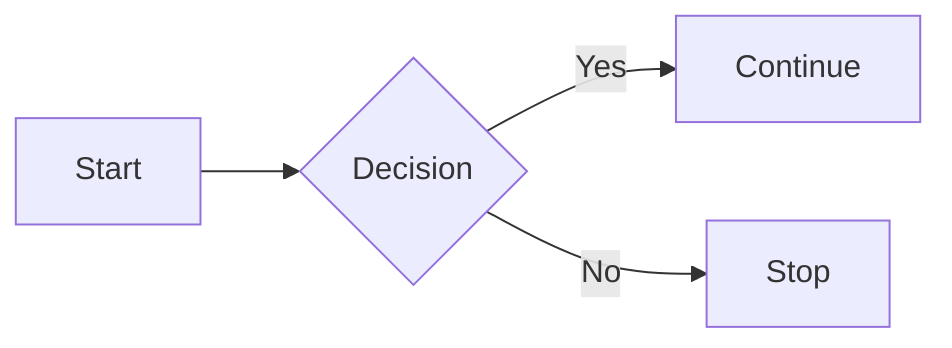
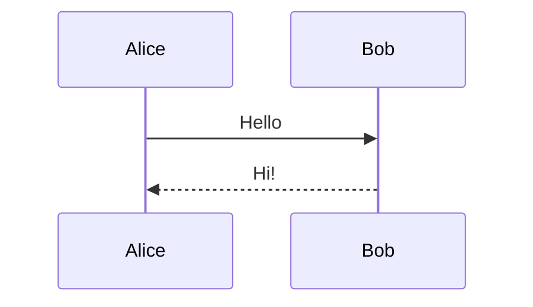
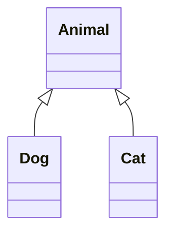

# GitHub Markdown Reference

> [!IMPORTANT]
> This reference covers **GitHub Flavored Markdown (GFM)**, the Markdown dialect used in GitHub repositories, README files, Wikis, Issues, and Pull Requests.

---

## 1. Headings

Headings organize your document into sections. GitHub supports six heading levels.

| Syntax | Description |
|---------|-------------|
| `# Heading 1` | Largest heading (use only once for the document title). |
| `## Heading 2` | Main section heading. |
| `### Heading 3` | Subsection heading. |
| `#### Heading 4` | Fourth-level heading. |
| `##### Heading 5` | Fifth-level heading. |
| `###### Heading 6` | Smallest heading. |

## Example:


# Level 1

## Level 2

### Level 3

#### Level 4

##### Level 5

###### Level 6

> [!TIP]
> Use only one **H1 (`#`)** per document. Structure the rest of the document using `##` and `###`.

---

## 2. Text Formatting

Markdown provides several ways to format text.

| Style | Syntax | Output |
|--------|--------|--------|
| Bold | `**Bold**` or `__Bold__` | **Bold** |
| Italic | `*Italic*` or `_Italic_` | *Italic* |
| Bold + Italic | `***Bold Italic***` | ***Bold Italic*** |
| Strikethrough | `~~Text~~` | ~~Text~~ |
| Inline Code | `` `code` `` | `code` |
| Subscript (HTML) | `<sub>Text</sub>text` | <sub>Text</sub>2 |
| Superscript (HTML) | `<sup>Text</sup>text` | <sup>Text</sup>2 |

## Example

**Bold**

*Italic*

***Bold Italic***

~~Deprecated~~

Use the `git status` command.

H<sub>2</sub>O

x<sup>2</sup>


> [!TIP]
> Prefer `**bold**` and `*italic*` for better readability and consistency.

---

## 3. Line Breaks


## Line Break

End a line with **two spaces** or use the HTML **`<br>`** tag.

```md
First line.  
Second line.

First line.<br>
Second line.
```

> [!NOTE]
> Empty lines create paragraphs. Two trailing spaces or `<br>` create a line break.

---

## 4. Lists

Markdown supports unordered, ordered, nested, and task lists.

---

## Unordered Lists

### Syntax

```md
- Item 1
- Item 2
  - Nested Item
  - Nested Item
- Item 3
```

### Example

- Item 1
- Item 2
  - Nested Item
  - Nested Item
- Item 3

You can also use `*` or `+` instead of `-`.

### Syntax

```md
* Item
* Item

+ Item
+ Item
```

### Example

* Item
* Item

+ Item
+ Item

---

## Ordered Lists

### Syntax

```md
1. First
2. Second
3. Third
```

### Example

1. First
2. Second
3. Third

### Nested Ordered List

#### Syntax

```md
1. First
   1. Sub-item
   2. Sub-item
2. Second
```

#### Example

1. First
   1. Sub-item
   2. Sub-item
2. Second

---

## Task Lists

### Syntax

```md
- [ ] Pending task
- [x] Completed task
```

### Example

- [ ] Pending task
- [x] Completed task

> [!TIP]
> Task lists are supported in GitHub README files, Issues, and Pull Requests, making them useful for checklists and progress tracking.

---

## 5. Blockquotes

Use blockquotes to highlight quoted text, notes, or quoted content.

## Basic Blockquote

### Syntax

```text
> This is a blockquote.
```

### Example

> This is a blockquote.

---

## Nested Blockquotes

### Syntax

```text
> Main quote
>
>> Nested quote
```

### Example

> Main quote
>
>> Nested quote

> [!TIP]
> Blockquotes can be nested by adding additional `>` characters.

---

## 6. Notice Blocks (GitHub Alerts)

GitHub supports special alert blocks for emphasizing important information.

| Type | Syntax |
|------|--------|
| Note | `> [!NOTE]` |
| Tip | `> [!TIP]` |
| Important | `> [!IMPORTANT]` |
| Warning | `> [!WARNING]` |
| Caution | `> [!CAUTION]` |

---

## Note

### Syntax

```text
> [!NOTE]
> General information.
```

### Example

> [!NOTE]
> General information.

---

## Tip

### Syntax

```text
> [!TIP]
> Helpful advice.
```

### Example

> [!TIP]
> Helpful advice.

---

## Important

### Syntax

```text
> [!IMPORTANT]
> Critical information.
```

### Example

> [!IMPORTANT]
> Critical information.

---

## Warning

### Syntax

```text
> [!WARNING]
> Something requires attention.
```

### Example

> [!WARNING]
> Something requires attention.

---

## Caution

### Syntax

```text
> [!CAUTION]
> Risk of data loss or irreversible action.
```

### Example

> [!CAUTION]
> Risk of data loss or irreversible action.

> [!TIP]
> GitHub Alerts are supported in GitHub repositories, README files, Issues, Pull Requests, and Wikis.

---

## 7. Horizontal Rules

Horizontal rules visually separate sections.

| Syntax |
|--------|
| `---` |
| `***` |
| `___` |

---

## Three Hyphens

### Syntax

```text
---
```

### Example

Section One

---

Section Two

---

> [!TIP]
> `---` is the most commonly used style and is recommended for consistency.

---

## 8. Code

Use inline code for short snippets and fenced code blocks for larger examples.

## Inline Code

### Syntax

```text
`git status`
```

### Example

Run `git status` to inspect the repository.

---

## Code Blocks

### Syntax

````text
```bash
git status
git add .
git commit -m "Initial commit"
```

````

## Syntax Highlighting

GitHub supports syntax highlighting for many languages.

| Language | Syntax |
|----------|--------|
| Bash | ` ```bash ` |
| Python | ` ```python ` |
| JavaScript | ` ```javascript ` |
| JSON | ` ```json ` |
| YAML | ` ```yaml ` |
| HTML | ` ```html ` |
| CSS | ` ```css ` |
| XML | ` ```xml ` |
| Markdown | ` ```md ` |

Example:


```python
def hello():
    print("Hello, world!")
```

> [!TIP]
> Always specify the language to improve readability.

---

## 9. Links

Markdown supports several types of links.

---

## Inline Links

### Syntax

```text
[GitHub](https://github.com)
```

### Example

[GitHub](https://github.com)

---

## Automatic Links

### Syntax

```text
https://github.com
```

### Example

https://github.com

---

## Email Links

### Syntax

```text
<john@example.com>
```

### Example

<john@example.com>

---

## Links to Sections

### Syntax

```text
[Go to Tables](#11-tables)
```

### Example

[Go to Tables](#11-tables)

---

## Links to Files

### Syntax

```text
[LICENSE](LICENSE)

[Contributing Guide](docs/CONTRIBUTING.md)
```

### Example

[LICENSE](LICENSE)

[Commands reference](COMMANDS.md)

---

## Links to Folders

### Syntax

```text
[Documentation](docs/)
```

### Example

[Documentation](docs/)

> [!NOTE]
> GitHub automatically generates anchor links from headings, allowing you to link directly to sections within the same document.

---

## 10. Images

Markdown supports both local and remote images.

---

## Basic Image

### Syntax

```text

```

### Example


---

## Image from a URL

### Syntax

```text

```

### Example


---

## Clickable Image

### Syntax

```text
[](https://github.com)
```

### Example

[](https://github.com)

---

## Resize an Image (HTML)

### Syntax

```html

```

### Example


---

## Center an Image (HTML)

### Syntax

```html
<p align="center">
  
</p>
```

### Example

<p align="center">
  
</p>

> [!TIP]
> Always include descriptive alt text so images remain accessible if they cannot be displayed.

---

## 11. Tables

Markdown tables organize structured information into rows and columns.

---

## Basic Table

### Syntax

```text
| Name | Role |
|------|------|
| Alice | Developer |
| Bob | Designer |
```

### Example

| Name | Role |
|------|------|
| Alice | Developer |
| Bob | Designer |

---

## Column Alignment

### Syntax

```text
| Left | Center | Right |
|:-----|:------:|------:|
| A | B | C |
```

### Example

| Left | Center | Right |
|:-----|:------:|------:|
| A | B | C |

---

## Escaping Vertical Bars

### Syntax

```text
Use \| inside a table cell.
```

### Example

Use \| inside a table cell.

> [!TIP]
> Keep tables concise and avoid using them for long paragraphs of text.

---

## 12. Badges

Badges provide visual information about a repository, such as build status, version, or license.

---

## Static Badge

### Syntax

```text

```

### Example


---

## Common Shields.io Badges

### Syntax

```text


```

### Example


---

## Badge Styles

| Style |
|-------|
| `flat` |
| `flat-square` |
| `plastic` |
| `for-the-badge` |
| `social` |

> [!TIP]
> [Shields.io](https://img.shields.io) is the most widely used service for generating GitHub badges.


---

## 13. Emojis

GitHub supports emoji shortcodes that are automatically converted into emojis.

| Syntax | Output |
|--------|--------|
| `:rocket:` | :rocket: |
| `:bug:` | :bug: |
| `:warning:` | :warning: |
| `:white_check_mark:` | :white_check_mark: |
| `:x:` | :x: |
| `:star:` | :star: |
| `:fire:` | :fire: |
| `:books:` | :books: |

---

### Syntax

```text
## Features :rocket:

- Fast :zap:
- Secure :lock:
- Open Source :star:
```

### Example

## Features :rocket:

- Fast :zap:
- Secure :lock:
- Open Source :star:

> [!TIP]
> GitHub supports hundreds of emojis. You can find the complete list in the GitHub Emoji Cheat Sheet.

---

## 14. HTML in Markdown

GitHub supports many HTML tags inside Markdown.

| Element | Example |
|--------|---------|
| Line break | `<br>` |
| Bold | `<strong>Text</strong>` |
| Italic | `<em>Text</em>` |
| Image | `` |
| Center content | `<p align="center">...</p>` |
| Keyboard key | `<kbd>Ctrl</kbd>` |
| Subscript | `<sub>2</sub>` |
| Superscript | `<sup>2</sup>` |

Example:

```html
<p align="center">
  
</p>
```

> [!TIP]
> Use HTML only when Markdown cannot achieve the desired formatting.

---

## 15. Collapsible Sections

Use `<details>` to hide large sections.

````md
<details>
<summary>Click to expand</summary>

Hidden content goes here.

- Item 1
- Item 2

</details>
````

Result:

<details>
<summary>Click to expand</summary>

Hidden content goes here.

</details>

---

## 16. Keyboard Keys

Display keyboard shortcuts with the `<kbd>` tag.

```md
Press <kbd>Ctrl</kbd> + <kbd>C</kbd> to copy.
```

Result:

Press <kbd>Ctrl</kbd> + <kbd>C</kbd> to copy.

---

## 17. Mermaid Diagrams

GitHub supports **Mermaid** diagrams inside fenced code blocks, allowing you to create diagrams directly in Markdown files.

## Flowchart

````md

````


---

## Sequence Diagram

````md

````


---

## Class Diagram

````md

````


> [!TIP]
> Mermaid diagrams are created using fenced code blocks with the `mermaid` language identifier.

> [!IMPORTANT]
> GitHub automatically renders Mermaid diagrams. No additional plugins or extensions are required.

> [!NOTE]
> Some Markdown editors do not support Mermaid rendering. In those editors, the diagrams will appear as code blocks, while GitHub will render them as interactive diagrams.
---

## 18. Footnotes

Use footnotes to add references.

```md
Markdown is simple.[^1]

[^1]: This is the footnote.
```

---

## 19. Mentions & References

| Syntax | Description |
|--------|-------------|
| `@username` | Mention a GitHub user. |
| `#123` | Reference an issue or pull request. |
| `owner/repository` | Reference another repository. |
| `abcdef1` | Reference a commit hash. |

Example:

```md
Thanks @octocat!

See #15 for details.

Related repository: octocat/Hello-World
```

---

## 20. Escaping Characters

Use a backslash (`\`) before special characters.

```md
\*Not italic\*

\# Not a heading

\`Not inline code\`
```

---

## 21. Best Practices

> [!TIP]
> - Use only one `#` heading per document.
> - Prefer `##` and `###` for sections.
> - Always specify a language for code blocks.
> - Add alt text to every image.
> - Keep tables concise.
> - Use notice blocks only when information deserves emphasis.
> - Use relative links for files within the repository.
> - Prefer Markdown over HTML unless extra formatting is needed.
> - Use `<details>` to collapse long examples.
> - Keep README files easy to scan with short sections and clear headings.


